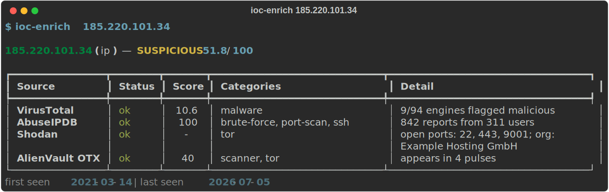
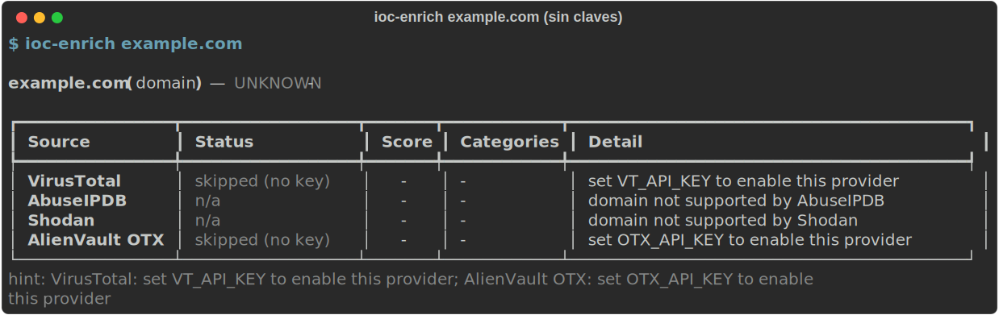

# ioc-enrich

CLI tool that takes an indicator of compromise (IP, domain, URL, or file hash) and
returns a **unified verdict** aggregated from multiple threat-intel sources:
[VirusTotal](https://www.virustotal.com), [AbuseIPDB](https://www.abuseipdb.com),
[Shodan](https://www.shodan.io) and [AlienVault OTX](https://otx.alienvault.com).

- IOC type is **auto-detected** — just pass the value.
- All providers are queried **concurrently** (httpx + asyncio).
- Providers with no API key or transient errors are **skipped and noted**, never fatal.
- Output as a rich table (default), `--json`, or a `--stix` (STIX 2.1) bundle.

## Install

```bash
pipx install .
```

Or in a virtualenv: `pip install .`

## Configuration

API keys are read from environment variables — never hardcoded. Copy
[.env.example](.env.example) and export the keys you have:

| Variable            | Provider       | Used for            |
| ------------------- | -------------- | ------------------- |
| `VT_API_KEY`        | VirusTotal     | all IOC types       |
| `ABUSEIPDB_API_KEY` | AbuseIPDB      | IPs                 |
| `SHODAN_API_KEY`    | Shodan         | IPs (context/vulns) |
| `OTX_API_KEY`       | AlienVault OTX | all IOC types       |

Any subset works: providers without a key are skipped gracefully.

## Usage

```bash
ioc-enrich 185.220.101.34          # IP
ioc-enrich evil-domain.example     # domain
ioc-enrich https://phish.example/login  # URL
ioc-enrich 44d88612fea8a8f36de82e1278abb02f  # hash (MD5/SHA1/SHA256)

ioc-enrich 185.220.101.34 --json   # machine-readable verdict
ioc-enrich 185.220.101.34 --stix   # STIX 2.1 bundle
```

### Sample output

Enriching an IP with all four providers configured (sample data):



Graceful degradation — providers without a key or that don't apply to the IOC
type are skipped and noted, never fatal:



The unified score is a weighted average of the sources that returned an
opinionated score; labels: `clean` (< 25), `suspicious` (25–59), `malicious` (≥ 60).

## Adding a provider

Subclass `ioc_enrich.providers.base.Provider`, implement `fetch()`, declare
`name`, `env_key` and `supported_types`, and register the class in
`ioc_enrich/providers/__init__.py::ALL_PROVIDERS`. Key handling, unsupported
types and error trapping are inherited from the base class.

## Development

```bash
pip install -e ".[dev]"
pytest            # all provider responses are mocked — no live calls
```

## License

[MIT](LICENSE)
